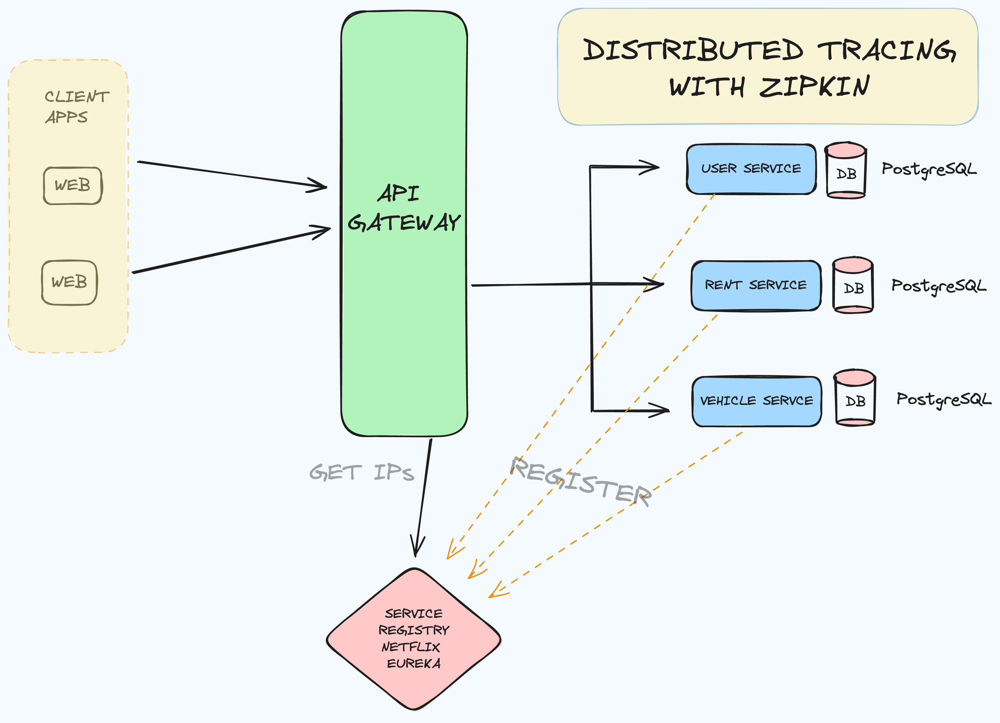

# Spring Boot Reactive Microservices Architecture

This project is a small example of a microservices architecture built with Spring Boot. It aims to demonstrate the basics of microservices, Eureka for service discovery, and inter-service communication using WebClient. The project includes the following components:

### Architecture



### Services

1. **API Gateway**: This service acts as a gateway for routing requests to the appropriate microservices. It is an Eureka client.

2. **Rent Service**: Manages the renting process, including creating and retrieving rental information. It is also an Eureka client.

3. **Service Registry**: A Eureka server that registers all microservices and provides service discovery.

4. **User Service**: Manages user information and operations. It is an Eureka client.

5. **Vehicle Service**: Manages vehicle information and operations. It is an Eureka client.

### Database Usage

- **user-service**: Manages user information using PostgreSQL.
- **vehicle-service**: Manages vehicle information using PostgreSQL.
- **rent-service**: Manages rental operations using PostgreSQL.

Each service in this project utilizes its own PostgreSQL database for data storage and management.


### Communication between Services

The microservices communicate with each other using WebClient. WebClient is a non-blocking, reactive client used for making HTTP requests. In this project, it is used to enable efficient and asynchronous communication between the services.

### Running the Project

Each service has its own `docker-compose.yaml` file for containerization. Additionally, there is a root-level `docker-compose.yaml` file for Zipkin, which is used for distributed tracing.

To run the project:

1. **Start the Service Registry**:
   ```bash
   cd service-registry
   docker-compose up -d

2. **Start the Microservices**:
   ```bash
   cd user-service
   docker-compose up -d

   cd vehicle-service
   docker-compose up -d
   
   cd rent-service
   docker-compose up -d
   
   cd api-gateway
   docker-compose up -d

### Features
* Service Discovery: Using Netflix Eureka for dynamic service registration and discovery.
* API Gateway: Centralized access point to the microservices.
* WebClient: Efficient inter-service communication.
* Docker Compose: Containerization of each microservice and Zipkin for easy deployment.
* Distributed Tracing: Using Zipkin to trace requests across microservices.

---
### I hope this project helps you understand the basics of building a microservices architecture with Spring Boot. If you have any questions or suggestions, feel free to reach out!
